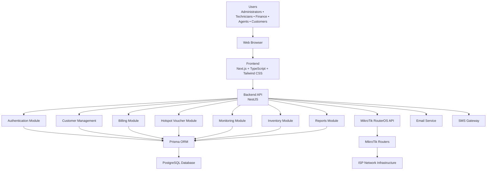

# AriTech NEXUS System Architecture

## Overview

The AriTech NEXUS platform follows a modern three-tier architecture consisting of a presentation layer, application layer, and data layer. The system integrates with MikroTik RouterOS to automate ISP operations, hotspot management, billing, monitoring, and customer management.

---

## System Architecture Diagram



---

# Architecture Layers

## 1. Presentation Layer

Responsible for all user interaction.

### Technology

- Next.js
- TypeScript
- Tailwind CSS

### Responsibilities

- User Authentication
- Dashboard
- Customer Management
- Billing
- Voucher Management
- Monitoring
- Reports
- Settings

---

## 2. Application Layer

Responsible for business logic.

### Technology

- NestJS

### Modules

- Authentication
- Users
- Roles
- Customers
- Plans
- Subscriptions
- Billing
- Payments
- Hotspot
- MikroTik Integration
- Monitoring
- Inventory
- Support
- Reports

---

## 3. Data Layer

Responsible for persistent storage.

### Technology

- PostgreSQL
- Prisma ORM

### Stores

- Users
- Customers
- Subscriptions
- Payments
- Invoices
- Routers
- Vouchers
- Inventory
- Support Tickets
- Audit Logs

---

## 4. Network Layer

Responsible for router communication.

### Technology

- MikroTik RouterOS API

### Functions

- PPPoE Management
- Hotspot Management
- Queue Management
- DHCP
- Firewall Rules
- Interface Monitoring

---

## 5. External Services

The platform integrates with external services.

### Email

- Invoice delivery
- Password reset
- Notifications

### SMS

- Payment reminders
- OTP verification
- Alerts

---

# Data Flow

1. Users access the application through a web browser.
2. The frontend communicates with the NestJS backend using HTTPS.
3. The backend processes business logic.
4. Prisma ORM communicates with PostgreSQL.
5. The backend communicates with MikroTik routers using the RouterOS API.
6. Email and SMS services are used for notifications.
7. Monitoring services collect health metrics from routers.

---

# Security Flow

Every request follows this sequence:

```
HTTPS Request
        │
        ▼
JWT Authentication
        │
        ▼
Role-Based Access Control (RBAC)
        │
        ▼
Business Logic
        │
        ▼
Prisma ORM
        │
        ▼
PostgreSQL Database
```

---

# Benefits of the Architecture

- Modular design
- Scalable infrastructure
- Secure communication
- Centralized management
- Automated ISP operations
- Easy maintenance
- Future mobile application support
- Multi-site deployment support