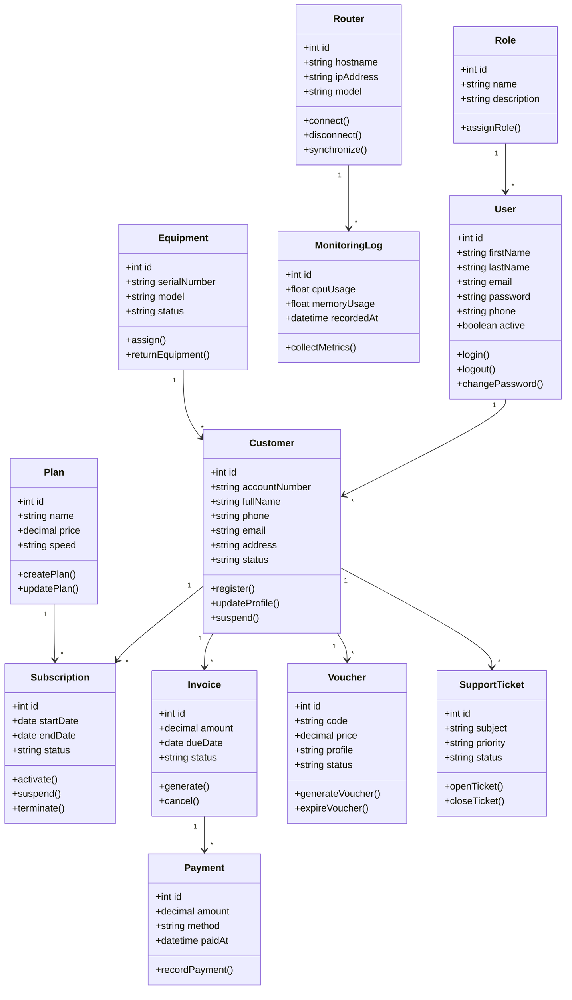

# AriTech NEXUS Class Diagram

## Overview

This class diagram provides a high-level object-oriented view of the AriTech NEXUS platform. It illustrates the primary classes, their attributes, methods, and relationships that support ISP management, billing, hotspot services, inventory, monitoring, and technical support.

---

# Class Diagram

---

# Main Classes

## User

Responsible for authentication and access to the platform.

---

## Role

Defines permissions and system access.

---

## Customer

Stores subscriber information.

---

## Plan

Defines internet service plans.

---

## Subscription

Links customers to service plans.

---

## Invoice

Stores billing records.

---

## Payment

Stores payment transactions.

---

## Voucher

Represents hotspot access vouchers.

---

## Router

Represents MikroTik routers managed by the platform.

---

## Monitoring Log

Stores router monitoring statistics.

---

## Equipment

Tracks ISP equipment and assignments.

---

## Support Ticket

Tracks customer support requests.

---

# Design Principles

- Single Responsibility Principle
- Modular Architecture
- Encapsulation
- Separation of Business Logic
- High Cohesion
- Low Coupling

---

# Summary

This class diagram provides the conceptual object model for AriTech NEXUS and serves as a guide for implementing the backend services and domain models.