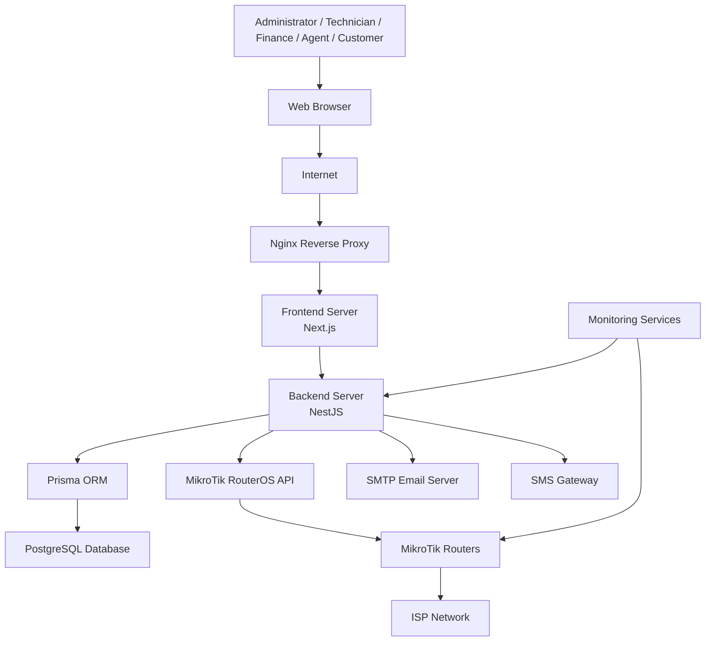

# AriTech NEXUS Deployment Diagram

## Overview

The Deployment Diagram illustrates the physical architecture of the AriTech NEXUS platform. It shows how the frontend, backend, database, networking equipment, and external services interact within a production environment.

---

# Deployment Diagram

---

# Deployment Components

## Client Layer

### Users

The platform supports multiple user roles:

- Administrator
- Finance Officer
- Technician
- Sales Agent
- Customer

Users access the system through a standard web browser.

---

## Presentation Layer

### Frontend Server

Technology:

- Next.js
- TypeScript
- Tailwind CSS

Responsibilities:

- User Interface
- Authentication Screens
- Dashboards
- Reports
- Forms

---

## Reverse Proxy

### Nginx

Responsibilities:

- HTTPS termination
- SSL certificates
- Request routing
- Static asset delivery
- Load balancing (future)
- Security headers

---

## Application Layer

### Backend Server

Technology:

- NestJS

Responsibilities:

- Business Logic
- Authentication
- Authorization
- Billing
- Customer Management
- Inventory
- Monitoring
- Reporting
- MikroTik Integration

---

## Data Layer

### Prisma ORM

Responsibilities:

- Database abstraction
- Schema management
- Query generation
- Database migrations

---

### PostgreSQL Database

Stores:

- Users
- Customers
- Plans
- Subscriptions
- Invoices
- Payments
- Vouchers
- Routers
- Monitoring Logs
- Inventory
- Support Tickets
- Audit Logs

---

## Network Layer

### MikroTik RouterOS

Responsibilities:

- PPPoE
- Hotspot
- DHCP
- Queues
- Firewall
- Interfaces
- Traffic Management

---

## ISP Infrastructure

Provides:

- Internet Access
- Customer Connectivity
- Hotspot Services
- Bandwidth Management

---

## External Services

### Email Server

Used for:

- Password Reset
- Invoice Delivery
- Notifications

---

### SMS Gateway

Used for:

- OTP Verification
- Payment Reminders
- Service Notifications

---

## Monitoring Services

Collects:

- CPU Usage
- Memory Usage
- Disk Usage
- Router Status
- Interface Statistics
- Traffic
- Uptime
- Alerts

---

# Communication Protocols

| Source | Destination | Protocol |
|----------|-------------|----------|
| Browser | Nginx | HTTPS |
| Nginx | Frontend | HTTP |
| Frontend | Backend | HTTPS / REST |
| Backend | PostgreSQL | Prisma ORM |
| Backend | MikroTik | RouterOS API |
| Monitoring | Routers | ICMP / SNMP |
| Backend | Email Server | SMTP |
| Backend | SMS Gateway | REST API |

---

# Production Environment

The recommended production deployment consists of:

- Ubuntu Server
- Docker
- Docker Compose
- Nginx Reverse Proxy
- Next.js Frontend
- NestJS Backend
- PostgreSQL Database
- MikroTik RouterOS
- SSL Certificates (Let's Encrypt)

---

# Scalability

The architecture supports future scaling through:

- Multiple Backend Instances
- Load Balancing
- Database Backups
- Horizontal Scaling
- Cloud Deployment
- Multi-site ISP Support

---

# Security

Security measures include:

- HTTPS Encryption
- JWT Authentication
- Role-Based Access Control (RBAC)
- Environment Variables
- Database Backups
- Audit Logging
- Firewall Rules
- Secure API Communication

---

# Summary

The deployment architecture provides a secure, scalable, and maintainable environment for AriTech NEXUS. It separates presentation, application, data, and network responsibilities while supporting future expansion as the platform grows.