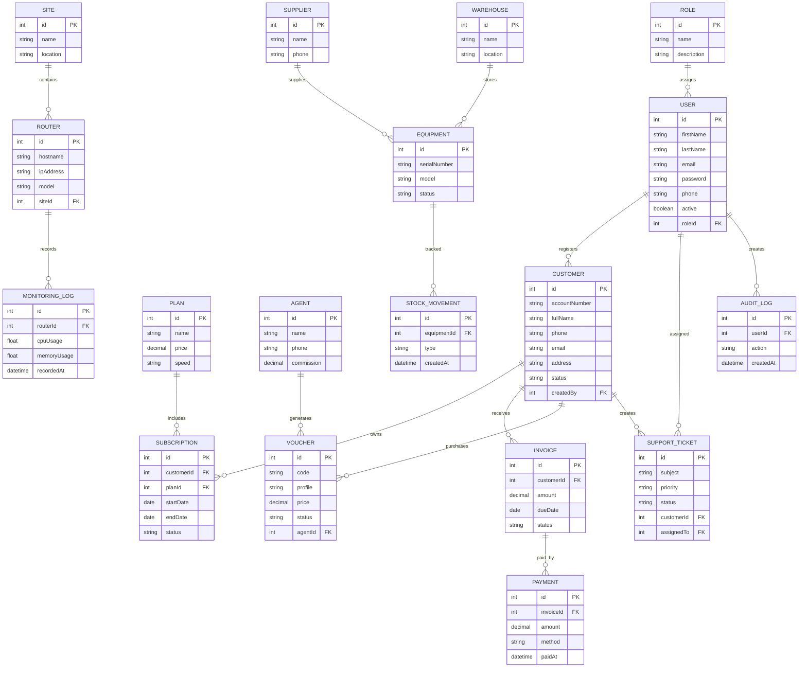

# AriTech NEXUS Entity Relationship Diagram (ERD)

## Overview

The Entity Relationship Diagram (ERD) defines the logical structure of the AriTech NEXUS database. It illustrates the entities, their attributes, and the relationships required to support ISP management, hotspot services, billing, inventory, monitoring, and customer support.

---

# Entity Relationship Diagram

---

# Core Entities

The database is organized into the following domains:

## User Management

- Roles
- Users

---

## Customer Management

- Customers
- Service Plans
- Subscriptions

---

## Billing

- Invoices
- Payments

---

## Hotspot

- Voucher Profiles
- Vouchers
- Agents

---

## Network

- Sites
- Routers
- Monitoring Logs

---

## Inventory

- Suppliers
- Warehouses
- Equipment
- Stock Movements

---

## Technical Support

- Support Tickets

---

## Security

- Audit Logs

---

# Database Design Principles

The AriTech NEXUS database follows these principles:

- Normalized relational database design.
- Primary keys uniquely identify each record.
- Foreign keys enforce referential integrity.
- Relationships minimize data duplication.
- Audit logging provides accountability.
- Modular entities support future scalability.

---

# Future Expansion

Additional entities planned for future releases include:

- Permissions
- Notifications
- Receipts
- Installation Requests
- Site Surveys
- Contracts
- SMS Logs
- Email Logs
- Backup Jobs
- Scheduled Tasks
- API Keys
- Customer Documents
- Network Alerts
- Payment Gateways
- Multi-Tenant Organizations

---

# Summary

This ERD represents the logical foundation of the AriTech NEXUS database and will serve as the blueprint for implementing the PostgreSQL schema using Prisma ORM.