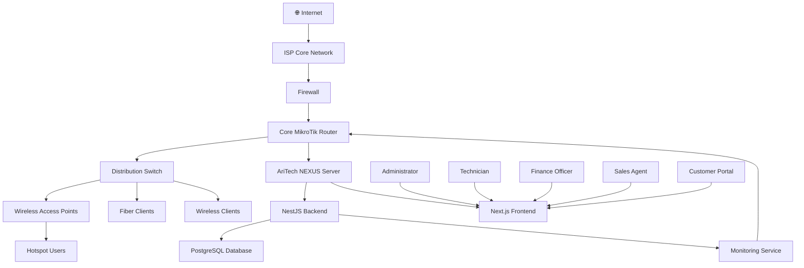

# AriTech NEXUS Network Diagram

## Overview

The Network Diagram illustrates the physical and logical network infrastructure supported by AriTech NEXUS. It demonstrates how customers, network devices, servers, and external services are interconnected to provide Internet access, hotspot services, monitoring, and centralized management.

---

# Network Diagram

---

# Network Components

## Internet

Provides upstream Internet connectivity from the Internet Service Provider.

---

## Firewall

Responsibilities:

- Network protection
- Traffic filtering
- Access control
- Threat prevention

---

## Core MikroTik Router

Responsible for:

- PPPoE Services
- Hotspot Management
- DHCP
- Routing
- NAT
- Queue Management
- Firewall Rules

---

## Distribution Switch

Distributes network connectivity to:

- Wireless Access Points
- Fiber Customers
- Wireless Customers
- Server Infrastructure

---

## Wireless Access Points

Provide Wi-Fi connectivity for:

- Hotspot Users
- Public Wi-Fi
- Customer Premises

---

## AriTech NEXUS Server

Hosts:

- Frontend Application
- Backend API
- Database Connectivity
- Monitoring Services

---

## Frontend

Technology:

- Next.js
- TypeScript
- Tailwind CSS

Provides the user interface for all system users.

---

## Backend

Technology:

- NestJS

Responsible for:

- Authentication
- Billing
- Customer Management
- Inventory
- Reports
- MikroTik Integration

---

## Database

Technology:

- PostgreSQL
- Prisma ORM

Stores all operational data.

---

## Monitoring Service

Collects:

- Router status
- CPU utilization
- Memory utilization
- Traffic statistics
- Interface health
- Alerts
- Uptime

---

# Connected Users

The platform supports the following user groups:

- Administrators
- Finance Officers
- Technicians
- Sales Agents
- Customers

Each user accesses the platform securely through a web browser.

---

# Communication Protocols

| Source | Destination | Protocol |
|----------|-------------|----------|
| Browser | Frontend | HTTPS |
| Frontend | Backend | HTTPS |
| Backend | PostgreSQL | Prisma ORM |
| Backend | MikroTik Router | RouterOS API |
| Monitoring | Router | ICMP / SNMP |
| Router | Internet | TCP/IP |

---

# Security Features

The network architecture includes:

- HTTPS encryption
- Firewall protection
- JWT authentication
- Role-Based Access Control (RBAC)
- Secure RouterOS API communication
- Audit logging
- Database backups
- Monitoring and alerting

---

# Scalability

The architecture supports future expansion through:

- Multiple MikroTik routers
- Additional branches
- Multiple ISP sites
- Cloud deployment
- Load balancing
- High availability
- Distributed monitoring

---

# Summary

The AriTech NEXUS network architecture provides a secure, scalable, and centrally managed infrastructure capable of supporting ISP operations, hotspot services, customer management, billing, monitoring, and future expansion.