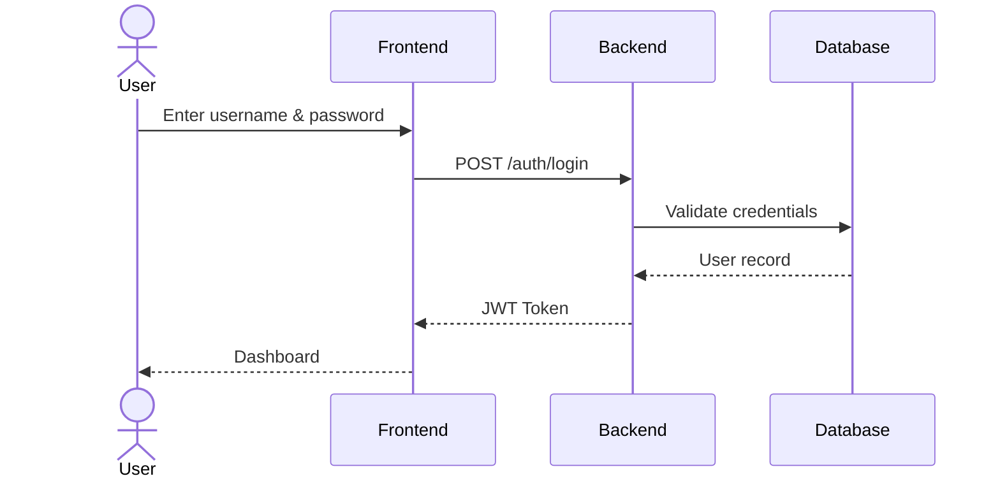
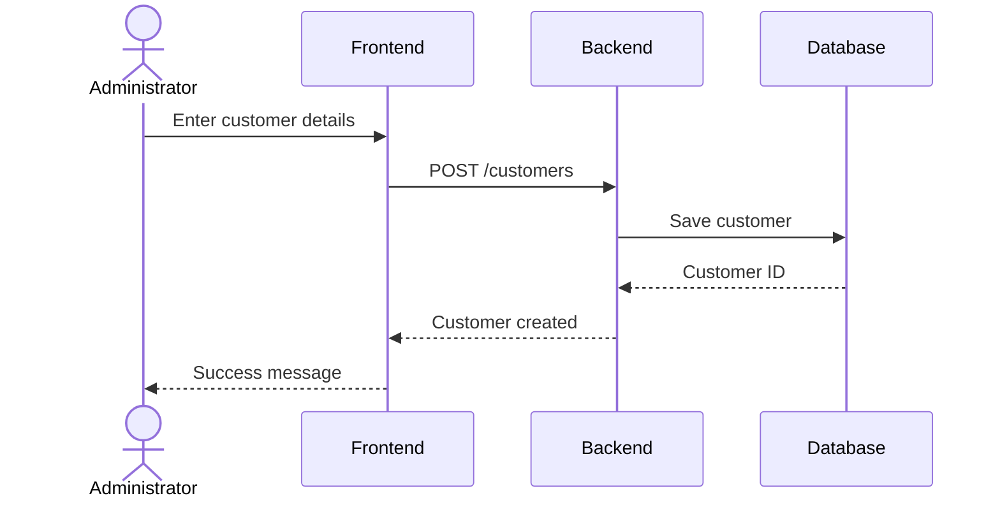
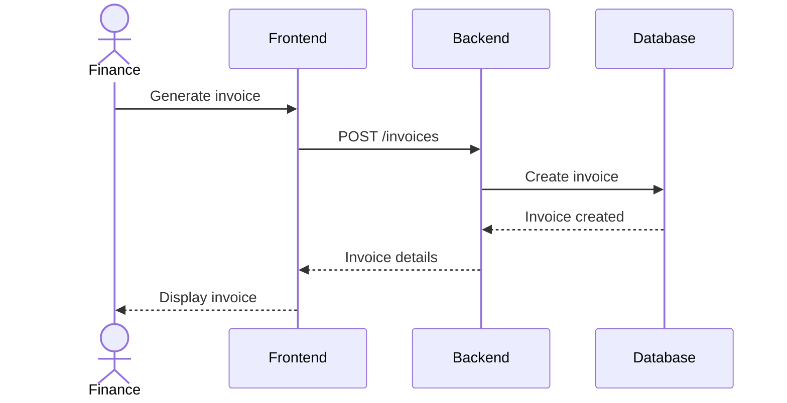
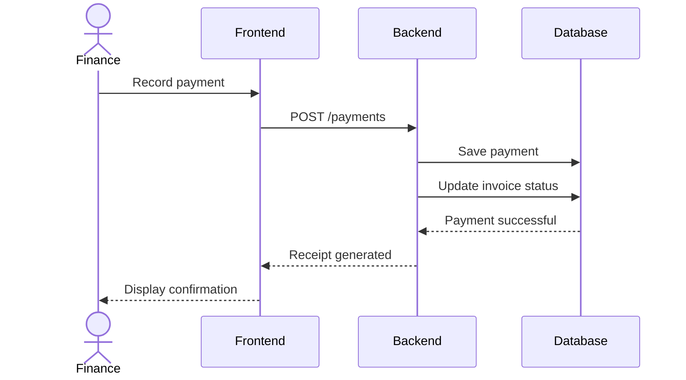
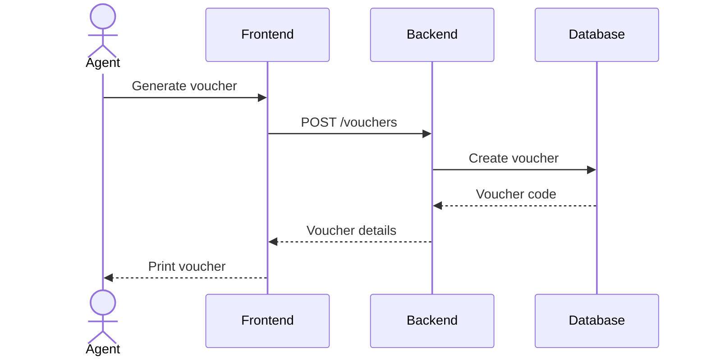
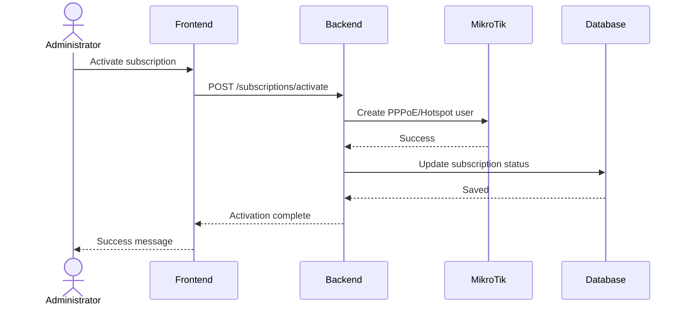

# AriTech NEXUS Sequence Diagrams

## Overview

This document contains the primary sequence diagrams that describe the interaction between users, the frontend, backend services, database, and external systems during common business processes.

---

# 1. User Login

---

# Description

The user authenticates with the system. After successful credential validation, the backend issues a JWT access token which is used for subsequent authenticated requests.

---

# 2. Customer Registration

---

# Description

An administrator registers a new customer. The backend validates the data and stores the customer record in the database.

---

# 3. Invoice Generation

---

# Description

The finance officer generates an invoice for a customer subscription. The invoice is stored in the database and returned to the frontend.

---

# 4. Payment Processing

---

# Description

After a payment is received, the backend records the transaction, updates the invoice status, and generates a receipt.

---

# 5. Hotspot Voucher Generation

---

# Description

A sales agent generates a hotspot voucher. The backend creates a unique voucher code and stores it in the database before returning it to the frontend.

---

# 6. MikroTik Customer Provisioning

---

# Description

When a customer's subscription is activated, the backend provisions the customer on the MikroTik router through the RouterOS API and updates the database.

---

# Summary

These sequence diagrams describe the most important operational workflows within AriTech NEXUS. They illustrate how users interact with the frontend, how requests are processed by the backend, how data is persisted in PostgreSQL, and how external systems such as MikroTik RouterOS participate in business operations.

Additional sequence diagrams may be added in future releases for:

- Password Reset
- Inventory Assignment
- Site Survey Workflow
- Support Ticket Resolution
- Router Monitoring
- Alert Notifications
- Report Generation
- Backup and Restore