# AriTech NEXUS Use Case Diagram

## Overview

The Use Case Diagram illustrates how different users (actors) interact with the AriTech NEXUS platform. It identifies the primary system functionalities available to each actor and defines the scope of the application from the user's perspective.

---

# Use Case Diagram

```mermaid
flowchart LR

Admin([Administrator])
Finance([Finance Officer])
Technician([Technician])
Agent([Sales Agent])
Customer([Customer])

subgraph AriTech NEXUS

UC1((Login))
UC2((Manage Users))
UC3((Manage Roles))
UC4((Manage Customers))
UC5((Manage Service Plans))
UC6((Manage Subscriptions))
UC7((Generate Invoices))
UC8((Record Payments))
UC9((Generate Receipts))
UC10((Generate Hotspot Vouchers))
UC11((Manage Voucher Sales))
UC12((Monitor Routers))
UC13((Manage Inventory))
UC14((Manage Support Tickets))
UC15((Generate Reports))
UC16((System Settings))
UC17((View Dashboard))
UC18((Perform Site Surveys))
UC19((Assign Equipment))
UC20((Logout))

end

Admin --> UC1
Admin --> UC2
Admin --> UC3
Admin --> UC4
Admin --> UC5
Admin --> UC6
Admin --> UC7
Admin --> UC8
Admin --> UC9
Admin --> UC10
Admin --> UC11
Admin --> UC12
Admin --> UC13
Admin --> UC14
Admin --> UC15
Admin --> UC16
Admin --> UC17
Admin --> UC20

Finance --> UC1
Finance --> UC7
Finance --> UC8
Finance --> UC9
Finance --> UC15
Finance --> UC17
Finance --> UC20

Technician --> UC1
Technician --> UC12
Technician --> UC13
Technician --> UC14
Technician --> UC18
Technician --> UC19
Technician --> UC17
Technician --> UC20

Agent --> UC1
Agent --> UC10
Agent --> UC11
Agent --> UC17
Agent --> UC20

Customer --> UC1
Customer --> UC17
Customer --> UC14
Customer --> UC20
```

---

# Actors

## Administrator

The Administrator has full access to all modules within AriTech NEXUS.

Responsibilities include:

- User Management
- Role Management
- Customer Management
- Billing
- Inventory
- Monitoring
- Reports
- System Configuration

---

## Finance Officer

Responsible for financial operations.

Functions include:

- Invoice Generation
- Payment Recording
- Receipt Generation
- Financial Reporting

---

## Technician

Responsible for network operations.

Functions include:

- Router Monitoring
- Equipment Management
- Site Surveys
- Technical Support
- Equipment Installation

---

## Sales Agent

Responsible for hotspot voucher operations.

Functions include:

- Voucher Generation
- Voucher Sales
- Customer Registration

---

## Customer

Customer portal functions include:

- Login
- Dashboard Access
- View Subscription
- View Bills
- Submit Support Tickets
- Logout

---

# Major Functional Areas

## Authentication

- Login
- Logout
- Password Management

---

## Customer Management

- Register Customer
- Update Customer
- Suspend Customer
- Reactivate Customer

---

## Billing

- Generate Invoice
- Record Payment
- Generate Receipt

---

## Hotspot Management

- Generate Voucher
- Sell Voucher
- Track Voucher Usage

---

## Monitoring

- Router Monitoring
- Alert Management
- Network Health

---

## Inventory

- Equipment Tracking
- Stock Management
- Equipment Assignment

---

## Reporting

- Customer Reports
- Revenue Reports
- Voucher Reports
- Monitoring Reports
- Inventory Reports

---

# Security

All use cases require authentication.

Access to each function is controlled using Role-Based Access Control (RBAC).

---

# Summary

The Use Case Diagram provides a high-level functional view of AriTech NEXUS by mapping system functionality to each user role. It serves as a reference for system implementation, testing, and user training.